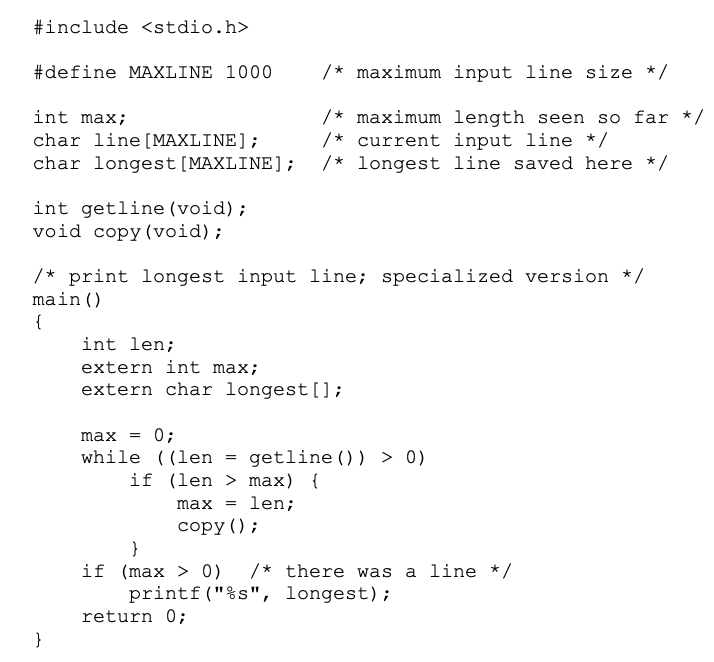

# Ch. 1 Notes

### 1.2 Variables and Arithmetic Expressions
- Within printf, ```%d``` is used to represent a decimal within a print statement, like so: ```printf("%d", fahr);``` If you put a number in front of d, like so: ```%6d```, then you are telling it to be at least 6 characters wise. If you have .2 in front of d like so: ```%.2d```, it is telling you to include 2 characters after the decimal point. You can combine the two methods. 


### 1.4 Symbolic Constants

- Bad practice to bury numbers in a program
- ```#define``` defines a *symbolic name/ symbolic constant*
```
#define LOWER   0
#define UPPER   300

main() {
    int fahr;

    for(fahr = LOWER; fahr <= UPPER; ...) ... 
}
```
- Notice no semicolon at end of ```#define``` line

### 1.5 Character Input and Output

- Text stream: sequence of characters divided into lines, each line consists of zero or more characters followed by a newline character
- ```getchar``` reads next input character from *text stream* and returns it
- ```putchar``` prints a character each time it is called
```
c = getchar();
putchar(c);
```
- File copying: 
- Why declare ```c``` as an integer? 
> The problem is distinguishing the end of input from valid data. The solution is that getchar returns a distinctive value when there is no more input, a value that cannot be confused with any real character. This value is called EOF, for ``end of file''. We must declare c to be a type big enough to hold any value that getchar returns. We can't use char since c must be big enough to hold EOF in addition to any possible char. Therefore we use int. EOF is an integer defined in <stdio.h>, but the specific numeric value doesn't matter as long as it is not the same as any char value. By using the symbolic constant, we are assured that nothing in the program depends on the specific numeric value.
- We can do this because it converts the char to its ASCII value, which is an integer. This happens when we have a character within single quotes.
- ```++nc``` or ```nc++``` increments variable nc by 1.

### 1.8 Arguments - Call by Value
- All function arguments are 'passed by value', meaning that the function is given the value of its arguments in temprorary variables rather than the originals. This is different than 'call by reference' that is seen within other languages.
- In addition: 
> When necessary, it is possible to arrange for a function to modify a variable in a calling routine. The caller must provide the address of the variable to be set (technically a pointer to the variable), and the called function must declare the parameter to be a pointer and access the variable indirectly through it. 
- Different for arrays, when an array is passed as an argument, the value passed to the function is the location/address of the beginning of the array - there is no copying of array elements. Therefore, the function can access and alter any argument of the array.

### 1.10 External Variables and Scope
- variables declared within the main function are *private* to main. No other function can have direct access to them. Refered to as 'automatic' varialbes (local variables).
> Because automatic variables come and go with function invocation, they do not retain their values from one call to the next, and must be explicitly set upon each entry. If they are not set, they will contain garbage.
- External variables are 'globally' accessible. Can be used instead of argument lists (arguments passed into a function) to communicate data between functions. They retain their value even after the functions that set them have returned.
- An external variable must be *defined* exactly once outside of any functions (sets aside storage for it). Also must be *declared* in each function that wants to access it. Example:

> In certain circumstances, the extern declaration can be omitted. If the definition of the external variable occurs in the source file before its use in a particular function, then there is no need for an extern declaration in the function. The extern declarations in main, getline and copy are thus redundant. In fact, common practice is to place definitions of all external variables at the beginning of the source file, and then omit all extern declarations.

> If the program is in several source files, and a variable is defined in file1 and used in file2 and file3, then extern declarations are needed in file2 and file3 to connect the occurrences of the variable. The usual practice is to collect extern declarations of variables and functions in a separate file, historically called a header, that is included by #include at the front of each source file. The suffix .h is conventional for header names. The functions of the standard library, for example, are declared in headers like <stdio.h>.

> Definition refers to the place where the variable is created or assigned storage; declaration refers to places where the nature of the variable is stated but no storage is allocated.

> Relying too heavily on external variables is fraught with peril since it leads to programs whose data connections are not all obvious - variables can be changed in unexpected and even inadvertent ways, and the program is hard to modify

