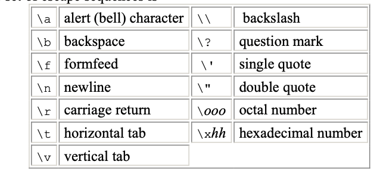

# Ch. 2 Notes

### Data Types & Sizes
- char: a single byte, holds one character in the local character set
- int: typically reflecting the natural size of integers on the host machine
- float: single-precision floating point
- double: double-precision floating point
- short and long can apply to integers. int will be natural size for a particular machine. short is often 16 bits, long 32 bits, and int either 16 or 32 bits. 
- signed or unsigned may be applied to char or any integer. unsigned numbers are always positive or zero. 
- > They obey the laws of arithmetic modulo 2n, where n is the number of bits in the type. So, for instance, if chars are 8 bits, unsigned char variables have values between 0 and 255, while signed chars have values between -128 and 127 (in a two's complement machine.) Whether plain chars are signed or unsigned is machine-dependent, but printable characters are always positive.
- standard headers <limits.h> and <float.h> contain symbolic constants for these sizes

### 2.3 Constants

- Escape sequences: 

- A constant expression may be evaluated during compilation rather than run-time
- enumeration constant, a list of constant integer values

### 2.7 Type Conversions
- 