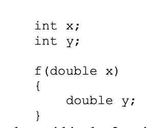

# Ch. 4 Notes: Functions and Program Structure

### 4.3 External Variables
- External variables are globally accessible, but you can define external variables and functions to be visible only within a single source file

### 4.5 Header Files
- Place common material (definitions and declarations shared among files) in a header file

### 4.6 Static Variables
- The static declaration limits the scope of that object to the rest of the source file being compiled
- Can be applied to functions as well
- Can also be applied to internal variables
- Internal static variables are local to a particular function

### 4.7 Register Variables
- A register declaration advises the compiler that the variable will be heavily used
- Idea is that register variables will be placed in machine registers
- There are restrictions. Only a few variables in each function may be kept in registers, and only certain types are allowed
- Can be ignored by compiler

### 4.8 Block Structure
- 
- Within the function f, occurrences of x refer to the parameter (a double); outside f, they refer to the external int